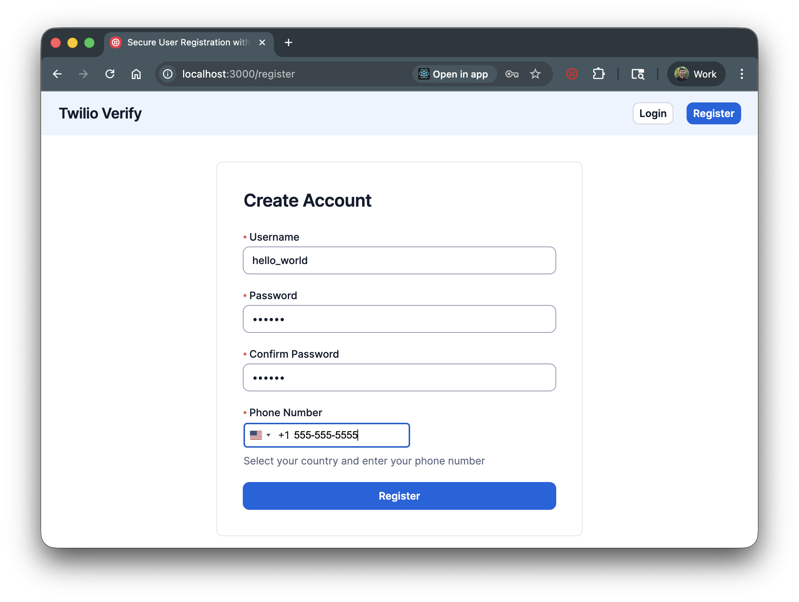
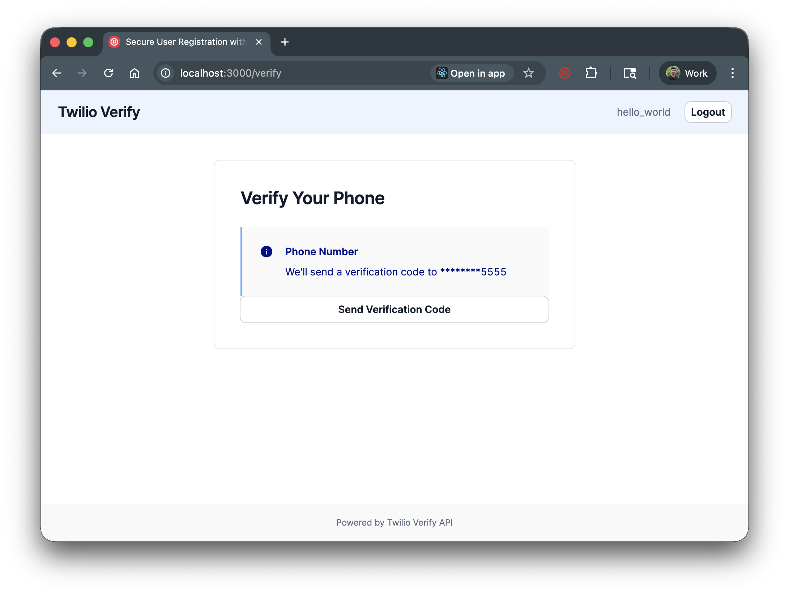

# Build a User Registration System with SMS Phone Verification

A Spring Boot application with user registration, authentication, and SMS phone verification using Twilio Verify. Users create an account, verify their phone number via OTP, and access protected content.





## Set up

### Requirements

- Java 21+ ([Download](https://www.oracle.com/java/technologies/downloads/) or install via [SDKMAN](https://sdkman.io/))
- [Maven](https://maven.apache.org/) 3.6+
- [A Twilio Verify Service](https://console.twilio.com/?frameUrl=/console/verify/services)

### Twilio Account Settings

| Config Value | Description |
| :----------- | :---------- |
| TWILIO_ACCOUNT_SID | Your Twilio Account SID from the [Console](https://www.twilio.com/console) |
| TWILIO_AUTH_TOKEN | Your Twilio Auth Token from the [Console](https://www.twilio.com/console) |
| TWILIO_VERIFY_SERVICE_SID | Create a Verify Service [here](https://www.twilio.com/console/verify/services) |

### Local development

1. Clone this repository and `cd` into it.

   ```bash
   git clone git@github.com:twilio-samples/sms-phone-verification-java.git
   cd sms-phone-verification-java
   ```

2. Install dependencies.

   ```bash
   mvn clean install
   ```

3. Set your environment variables.

   ```bash
   cp .env.example .env
   ```

   Edit `.env` with your Twilio credentials.

4. Run the application.

   ```bash
   mvn spring-boot:run
   ```

5. Open http://localhost:8080 to register an account and verify your phone number.

## Tests

You can run the tests locally by typing:

```bash
mvn test
```

## Resources

- [Twilio Verify API Documentation](https://www.twilio.com/docs/verify/api)
- [Twilio Java SDK Documentation](https://www.twilio.com/docs/libraries/reference/twilio-java)
- [Spring Boot Documentation](https://spring.io/projects/spring-boot)
- [SMS Phone Verification CodeExchange Page](https://www.twilio.com/code-exchange/sms-phone-verification)

## Contributing

This template is open source and welcomes contributions. All contributions are subject to our [Code of Conduct](https://github.com/twilio-labs/.github/blob/master/CODE_OF_CONDUCT.md).

## License

[MIT](http://www.opensource.org/licenses/mit-license.html)
